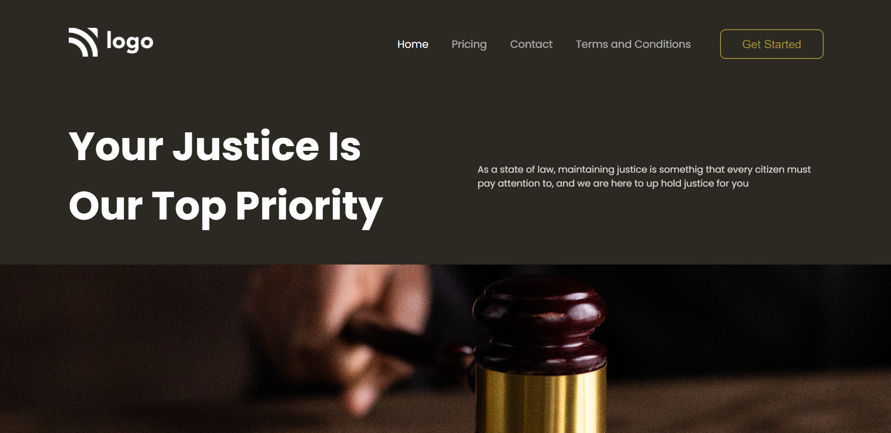

# Project_03 - HTML  and CSS 

---

## Project 03 [Live Link](https://project-03-themohitgupta.netlify.app)

---
## What I learned from this Project?

- Learned about **positioning**.
- Learned about how to add **background** and **position** them accordingly.
- Learned about how to add diffrent **fonts** from **Google Fonts**.
- Learned about use of **margin** and **padding**.
 
---

### This Project took me around **2 hours** to complete.

---

---
